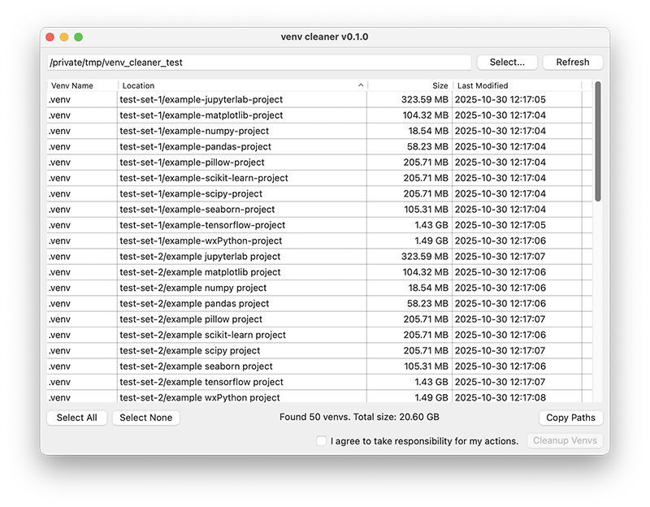

# Venv Cleaner

A GUI tool to clean up venv directories that have accumulated over time.



## Quick Start

The simplest way is to use [uvx](https://docs.astral.sh/uv/guides/tools/):

```bash
uvx venvcleaner
```

If you want to specify a directory path:

```bash
uvx venvcleaner /path/to/directory
```

To start with the latest version from the GitHub repository:

```bash
uvx git+https://github.com/yamakox/venvcleaner
```

## License

This software is distributed under the terms of the [MIT License](./LICENSE).
